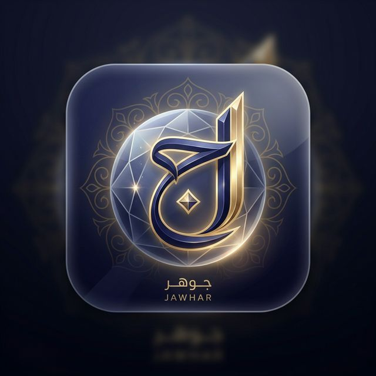
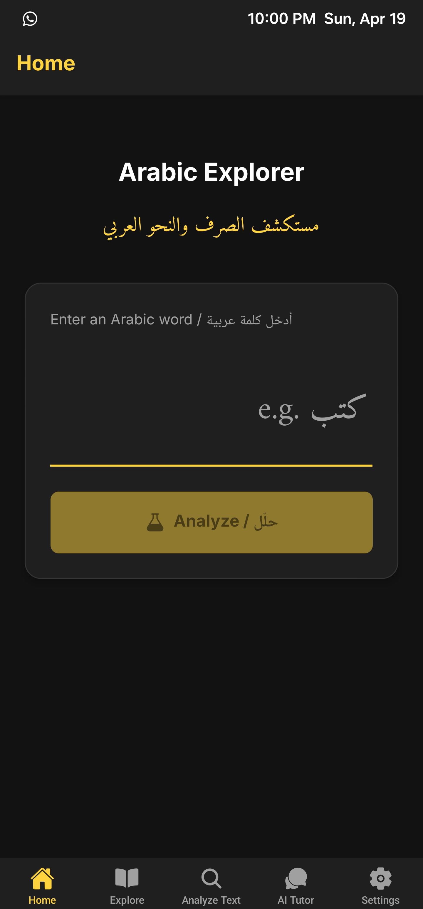
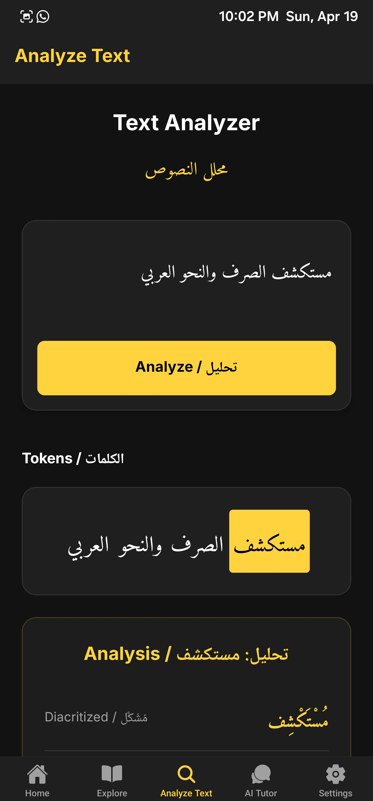
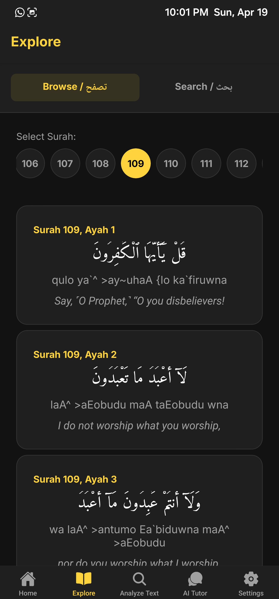
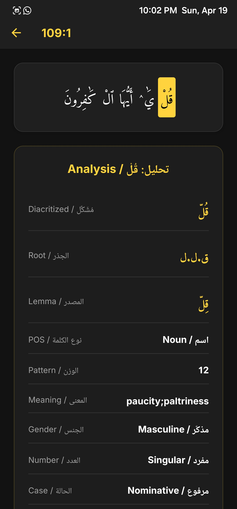
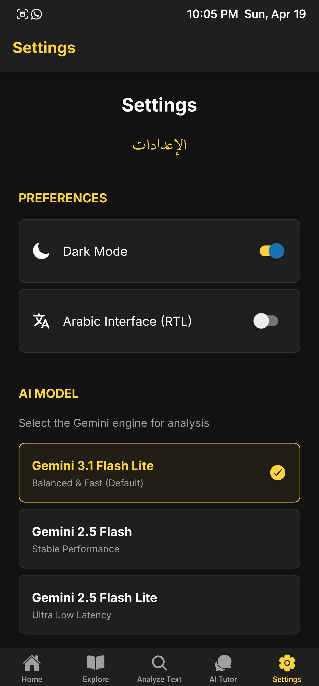
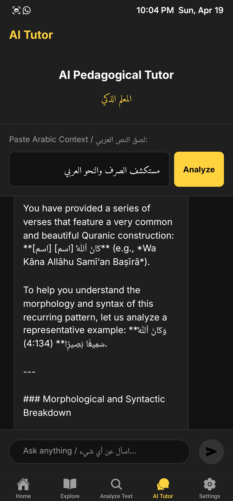
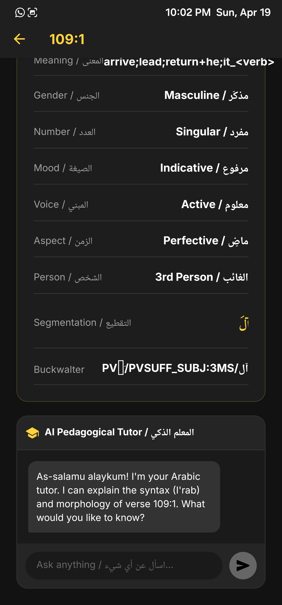
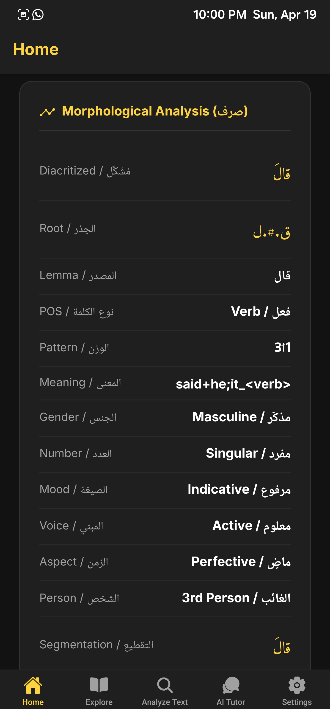
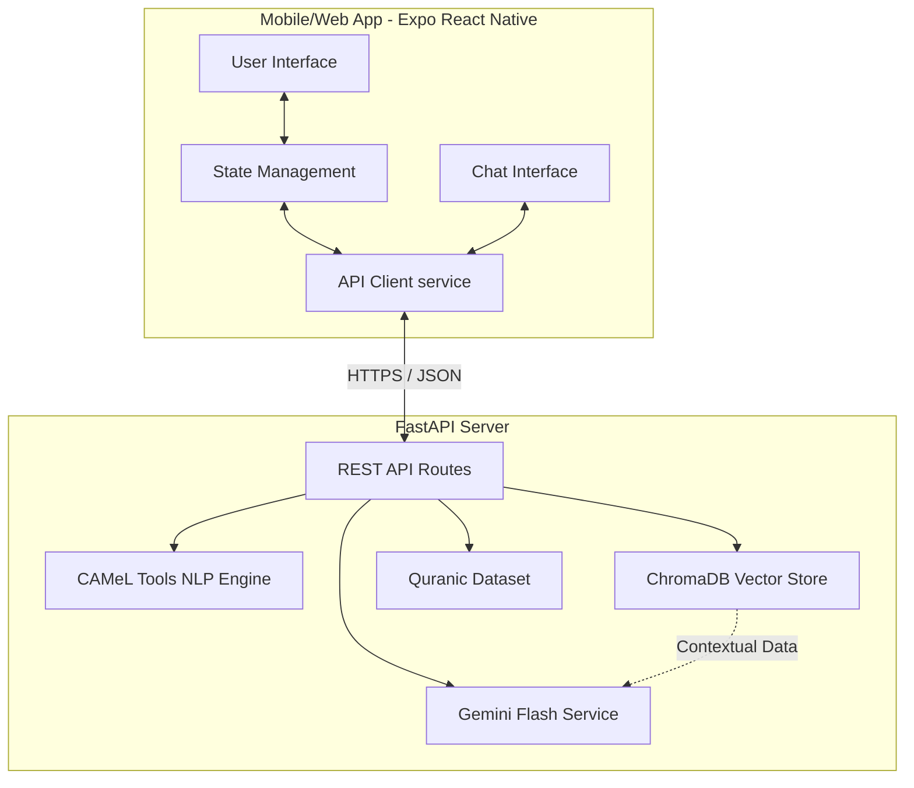

<div align="center">
  

  # Jawhar (جوهر) - Arabic Morphosyntactic Explorer

  **An AI-driven pedagogical tutor for Classical Arabic**
</div>

<br />

<div align="center">

[](https://huggingface.co/spaces/meherali/jawhar)
[](https://opensource.org/licenses/MIT)

</div>

<div align="center">

  
  
  
  
  
  

</div>

## Overview

**Jawhar (جوهر)** is an advanced, AI-driven pedagogical tool designed for exploring the classical Arabic corpus (specifically the Quran). The platform offers deep morphological analysis, semantic search capabilities, and an interactive AI tutor designed to facilitate learning. Leveraging state-of-the-art NLP tools like CAMeL and Google's Gemini Flash, Jawhar breaks down complex Arabic words into digestible morphological and syntactic components.

---

## Screenshots

| Main Dashboard | Analyze Text | Explore Verses | Verse Detail |
| :---: | :---: | :---: | :---: |
|  |  |  |  |

| Settings | AI Tutor Chat | Word Analysis | Camel Analysis |
| :---: | :---: | :---: | :---: |
|  |  |  |  |

---

## Features

- **Deep Morphological Analysis (Sarf)**: Interactive word-by-word breakdown showing Root, Lemma, POS tags, Person, Voice, Aspect, Case, and meaning using CAMeL Tools.
- **Semantic Search**: Search the Quranic corpus using a highly specialized Vector DB (ChromaDB) RAG pipeline.
- **AI Pedagogical Tutor (Jawhar AI)**: Engage with a Gemini-powered AI tutor that provides I'rab (syntax) and Sarf (morphological) explanations tailored to your selections.
- **Bilingual and RTL**: A perfectly localized UI in both Arabic and English with seamless Right-to-Left (RTL) transition.
- **Custom Modern UI**: A premium dark-mode interface embellished with Glassmorphism and subtle animations.

---

## System Architecture

The project employs a modern separated frontend/backend architecture, integrating cutting edge AI and NLP components:



---

## Directory Structure

```text
jawhar/
├── backend/              # Python FastAPI Application
│   ├── app/              # Microservices & API Routes
│   ├── scripts/          # Database & Vector DB population utilities
│   ├── tests/            # Pytest test suite
│   ├── Dockerfile        # Production Containerization setup
│   └── requirements.txt  # Python backend dependencies
├── frontend/             # Expo React Native App
│   ├── src/              # Reusable UI Components, Services, Utilities
│   ├── app/              # Expo Router specific screens and tabs
│   ├── assets/           # Application images and fonts
│   └── package.json      # Node.js dependencies
├── dataset/              # Base Quranic Morphology Corpus (v0.4)
├── dev.sh                # Zero-config Orchestration Script for locals
└── README.md             # You are here!
```

---

## Deployment

The project is designed with seamless deployment to optimal environments.

### Backend (Hugging Face Spaces)
The backend is Dockerized and deployed gracefully to Hugging Face Spaces.

**Remote Origin Deployment**:
`git push https://<USER>:<TOKEN>@huggingface.co/spaces/<USER>/jawhar hf-deploy:main --force`

- **Production API**: `https://meherali-jawhar.hf.space/api/v1`
- **Space URL**: [Meherali Jawhar Space](https://huggingface.co/spaces/meherali/jawhar)

### Frontend (Vercel)
The React Native app can be readily built and shipped to Vercel via a continuous deployment process linking directly to your GitHub remote.
Be sure to set the `EXPO_PUBLIC_API_URL` to your production Hugging Face Spaces API.

---

## Local Setup and Development

Do you want to run Jawhar locally on your machine?

### Prerequisites
- **Python 3.12+**
- **Node.js 18+** and **pnpm**
- **Gemini API Key**: Grab one from [Google AI Studio](https://aistudio.google.com/)

### Step-by-Step Configuration

1. **Clone the Repo:**
   ```bash
   git clone https://github.com/magic-meer/Arabic-Morphosyntactic-Explorer.git
   cd Arabic-Morphosyntactic-Explorer
   ```

2. **Environment Variables:**
   Create a `.env` file in the `backend/` directory:
   ```env
   GEMINI_API_KEY=your_gemini_api_key_here
   ```

3. **Running the Application (One-Command setup):**
   ```bash
   ./dev.sh
   ```
   *This script orchestrates both the backend (Uvicorn port `8000`) and the frontend Expo server simultaneously.*

4. **Running Individually:**
   - **Backend:**
     ```bash
     cd backend && pip install -r requirements.txt
     uvicorn app.main:app --reload --port 8000
     ```
   - **Frontend:**
     ```bash
     cd frontend && pnpm install
     npx expo start
     ```

---

## Contributing

Contributions are more than welcome!
Feel free to open an issue or fork the repository and submit a Pull Request.

---

## License

[MIT License](https://opensource.org/licenses/MIT)

*Jawhar is built to democratize Arabic learning. Explore, analyze, and learn.*
